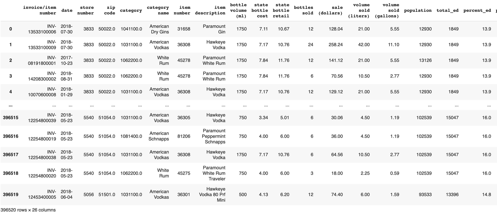
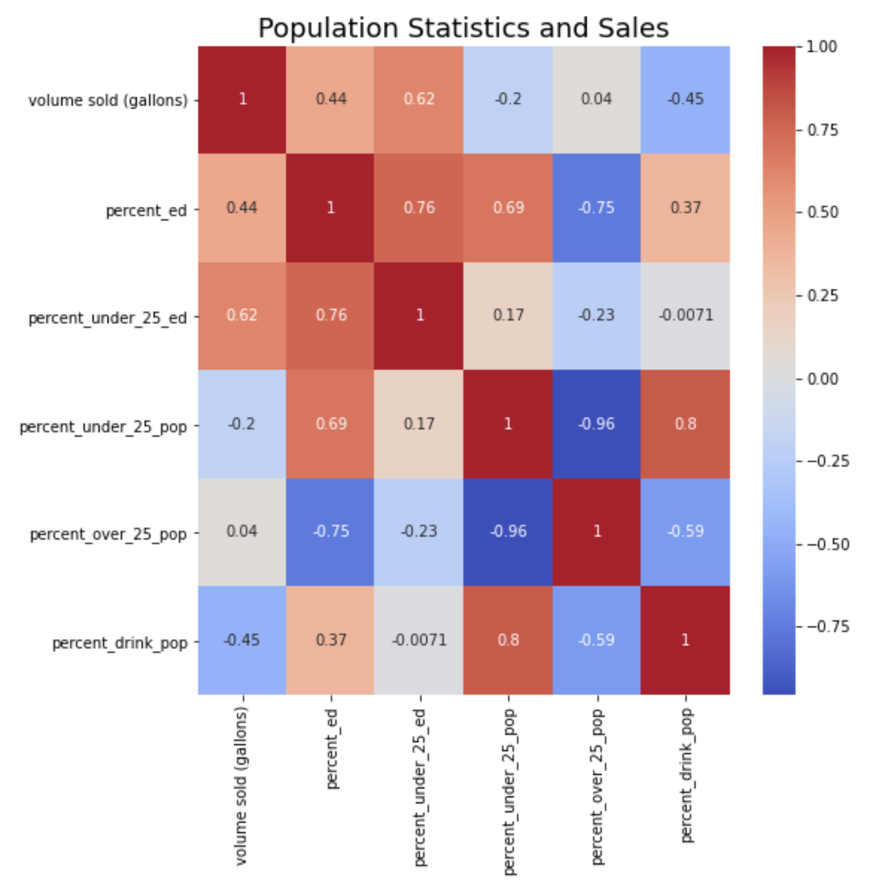

# Liquor Sales Supervised Learning Project

Identify trends in Luxco Inc's liquor sales for Iowa. 

How well a liquor distributor prevents stockouts, optimizes distribution, and effectively advertizes can make or break thier success. The purpose of this project is to identify trends for Luxco Inc's liquor sales in Iowa that are critical to operating optimally. 
 
</img>

# DATA:

The data for this project is sourced from two places
1) Iowa Liqour Sales - Google BigQuery (https://console.cloud.google.com/marketplace/details/iowa-department-of-commerce/iowa-liquor-sales) - Each observation is an invoice for a liqour sale that contains geographic, vendor, and sale item(s) information.

2) Iowa Population Demographics - Iowa Government Website (https://data.iowa.gov/) - Each observation contains County-level demographic and education information.

# DATA ANALYSIS:

# 1. Data Collection:
In this step I collect and synthesize data.

# 2. Exploratory Analysis:
In this step the relationships between sales (in dollars) and other features are explored and visualized.

# 3. Modeling Sales:
In this step the unique dataset I put together is used to predict yearly liquor sales per county in Iowa using data from the previous year.

-----------------------------------------------------------------------------------------------------------

# Data Collection 

**Step 1 : Selecting the data**
The following steps are preformed using Google BigQuery

- Identify top distributers in Iowa Liquor Sales dataset
- Audit top distributers by the variety of alcohol they sell
- Select a top distributer that sells a wide variety of alcohol -- Luxico Inc-- and subset data for years 2017-2018 

- Select county-level demographic data for years 2017-2018

- Select county-level education data for years 2017-2018

### Conclusion: There are 99 counties in Iowa. Luxico Inc is the second largest distributer in Iowa, and sells 34 different categories of alcohol. 

**Step 2 : Aggregating the data**
The following steps were preformed using Python functionalities

- Clean the data
- Combine liquor invoice, demographic, and education CSV sheets on county name

**Step 3 : Feature Engineering**
The following steps were preformed using Pandas

- Create columns for...
   * The total educated population under the age of 25
   * The percent of population under the age of 25
   * The percent of population over 25
   * The percent of the population that is of drinking age
 
 - The final df 
 </img>
 
# Exploratory Analysis
- I divide the analysis into the following parts:

**A) Yearly Analysis**: Sales per category, sales per county, sales per bottle volume

**B) Monthly Analysis**: Total sales, sales per category

**C) Customer Analysis**: Analyzing relationship between population demographics and sales per county. 

**D) Predicting Sales**: Using demographic and sales data from 2017 to predict yearly sales per county for 2018.

# A) Yearly Analysis :
**Step 1 : Exploring the data**

The following steps are preformed using pandas functionalities
- Examine volume of liqour sold in gallons grouped by category
- Examine volume of liquor sold in gallons grouped by county
- Examine volume of liquor sold in gallons grouped by bottle size 

# A) Yearly Analysis :
**Step 2 : Visualizing the data**

In this step, I visualize the previous findings using plotly.express 

</img>

### Conclusion: American Vodkas account for nearly half of all sales

</img>

### Conclusion: Ten out of ninety-nine counties account for over sixty percent of sales

</img>

### Conclusion: 1750ml, 1000ml, and 750ml the dominate size of bottles sold

# B) Monthly Analysis :
**Step 1 : Exploring the data**

In this step, I preformed the following using pandas functionalities
- Examine total sales per month
- Examine total sales per month by category of alcohol 

# B) Monthly Analysis :
**Step 2 : Visualizing the data**

In this step, I visualized the previous findings using seaborn

</img>

</img>

### Conclusion: Sales appear to spike in even numbered months and fall in odd numbered months.

</img>

</img>

### Conclusion: Certain categories of alcohol appear to be seasonaly ordered i.e. mixto tequila, while others show more consistency. 

# C) Customer Analysis :
**Step 1 : Exploring the data**

In this step, I preformed the following using pandas functionalities
- Examine the relationship between population demographics per county and sales

# C) Customer Analysis :
**Step 2 : Visualizing the data**

In this step, I visualized the previous findings using ploty.express

</img>

### Conclusion: Sales are highly correlated to the percent of educated population under 25.

# Modeling Sales
